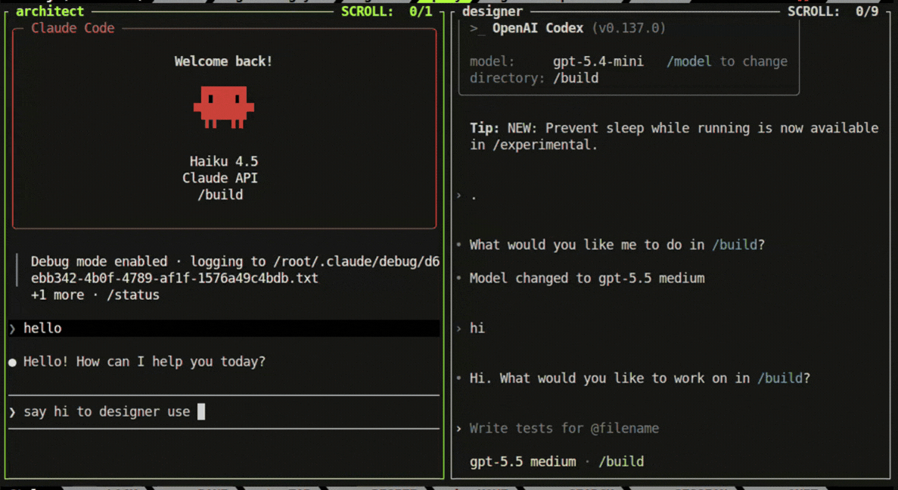

# omni

> **Omni lets AI coding agents (Claude, Codex, Gemini) collaborate — messaging each other, sharing hooks, and coordinating tasks over a local communication transport.**



- Inter-agent messaging via axolink MCP transport
- Auto retries on failed tool calls and hook events
- Claude Code, OpenAI Codex, and Gemini (Agy) agent sessions

> [!IMPORTANT]
> ## Install
>
> **Linux and Windows (WSL 2)**
>
> ```bash
> curl -fsSL https://raw.githubusercontent.com/Shaik-Sirajuddin/omni/main/install.sh | bash
> ```
>
> Requires `sudo`. For WSL 2, enable systemd first — add `[boot]\nsystemd=true` to `/etc/wsl.conf` then run `wsl --shutdown`.
>
> → See [docs/quickstart.md](docs/quickstart.md) for upgrade instructions and full setup details.

## Quick reference

```bash
omni team init                           # initialise a team in the current workspace
omni agent init -r -p claude <name>      # create (or resume) a Claude agent
omni agent list                          # list running sessions
omni agent resume <name>                 # attach to a session
omni agent exec <name> -- <cmd>          # run a command inside a session
```

> [!NOTE]
> Omni broadcasts MCP hook events (`PreToolUse`, `PostToolUse`, `SessionStart`, …) to all agents. Pre-hook side-effects are intentional — one agent can influence another's next action.

## Development

```bash
make docker-up       # start the dev container (requires .env.docker)
make docker-rebuild  # rebuild image after code changes
make docker-connect  # open a shell in the running container
```

→ See [development/](development/) for docker setup and `.env.docker.example`.

## License

Licensed under the [GNU Affero General Public License v3.0](LICENSE).
