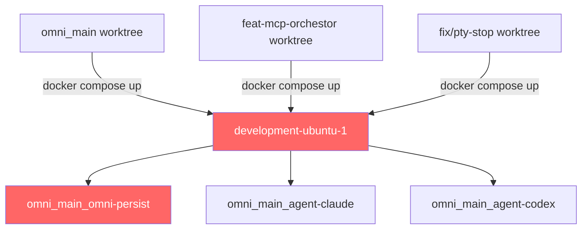
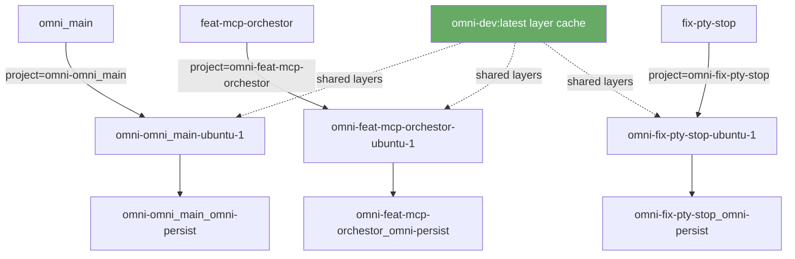
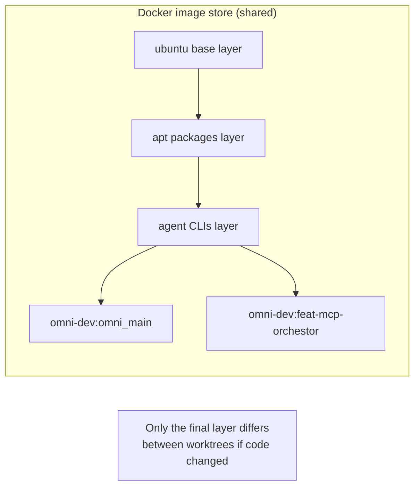

# Worktree-Scoped Docker Environments

## Problem

All git worktrees share the same Docker project name, container names, and volumes.
Stopping or rebuilding in one worktree tears down the environment for all others.



**Root cause:** `COMPOSE_PROJECT_NAME` defaults to the directory basename of where `docker compose` is invoked — all worktrees share the same compose file path, so they all resolve to `omni_main`.

---

## Solution

Derive `COMPOSE_PROJECT_NAME` and the image tag from the **current worktree's directory name** in the Makefile. Docker images share underlying layer cache (content-addressed), so per-worktree tags are free.



### Layer caching



---

## Implementation

### Makefile changes

```makefile
WORKTREE_NAME     := $(notdir $(CURDIR))
COMPOSE_PROJECT   := omni-$(WORKTREE_NAME)
IMAGE_TAG         := omni-dev:$(WORKTREE_NAME)
export COMPOSE_PROJECT_NAME := $(COMPOSE_PROJECT)
```

Pass `IMAGE_TAG` as build arg override so the compose `image:` field is overridden per worktree:

```makefile
docker-build:
    docker compose -f $(COMPOSE_FILE) build \
        --build-arg VERSION=$(VERSION) \
        --build-arg IMAGE_TAG=$(IMAGE_TAG)
```

Override the image name in compose via env var `OMNI_DEV_IMAGE`:

```yaml
# docker-compose.yaml
services:
  ubuntu:
    image: ${OMNI_DEV_IMAGE:-omni-dev:latest}
```

```makefile
docker-up: dev-preflight docker-fix-volumes
    OMNI_DEV_IMAGE=$(IMAGE_TAG) docker compose -f $(COMPOSE_FILE) up -d --wait
```

### Volume fix-up target

`docker-fix-volumes` already uses pattern `grep '_agent-codex$$'` which will match the namespaced volume name — no change needed.

---

## Behaviour after fix

| Action | Before | After |
|--------|--------|-------|
| `make docker-up` in any worktree | Attaches to same `development-ubuntu-1` | Creates/reuses `omni-<worktree>-ubuntu-1` |
| `make docker-down` in worktree A | Stops container used by all worktrees | Stops only worktree A's container |
| `make docker-rebuild` in worktree B | Rebuilds image, breaks worktree A | Rebuilds `omni-dev:<worktree-B>`, worktree A unaffected |
| Image layer cache | N/A | Shared across all worktrees via Docker layer dedup |
| `docker ps` visibility | One container | One container per active worktree |
